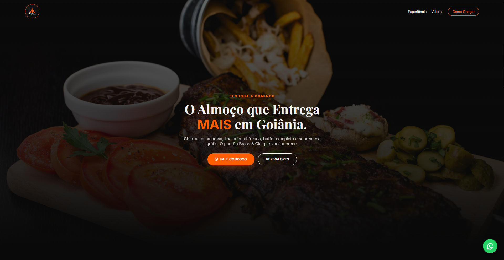
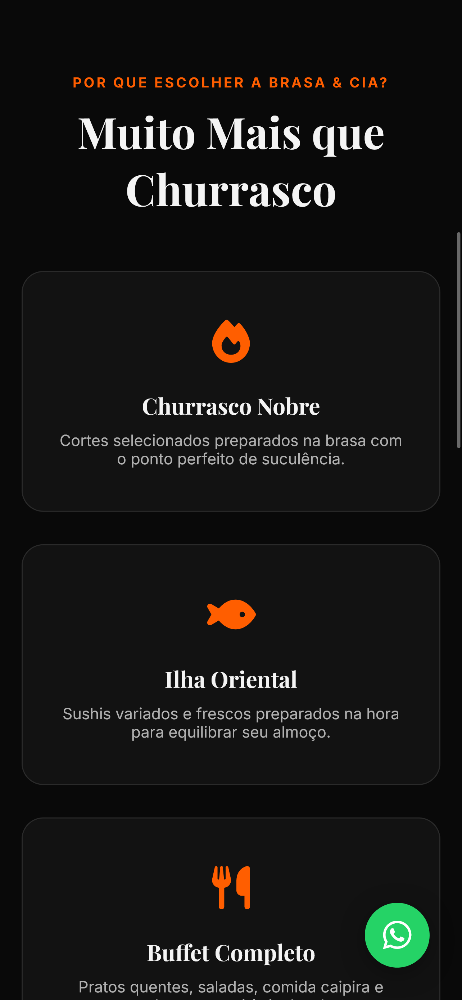

# 🍖 Brasa & Cia - Landing Page de Churrascaria

Uma landing page moderna, responsiva e de alta conversão desenvolvida para o setor gastronômico. Este projeto foi criado para demonstrar habilidades em Front-End, focando em performance, design limpo e experiência do usuário.

> **Status do Projeto:** 🚀 Concluído

---

## 📸 Visual do Projeto

Aqui você pode ver como a interface se adapta a diferentes dispositivos:

### Desktop
<p align="center">
  
</p>

### Mobile
<p align="center">
  
</p>

---

## 🛠️ Tecnologias Utilizadas

O projeto foi construído utilizando as melhores práticas de desenvolvimento web moderno:

* **HTML5**: Estruturação semântica para melhor SEO.
* **CSS3**: Estilização avançada com Flexbox e Grid, garantindo total responsividade.
* **JavaScript**: Manipulação de DOM para interatividade (menus, animações e máscaras).
* **Google Maps API**: Integração de mapa interativo para localização.

---

## 🌟 Diferenciais da Landing Page

- [x] **Design Responsivo:** Adaptado para smartphones, tablets e desktops.
- [x] **Call to Action (CTA):** Botões estratégicos para reservas via WhatsApp.
- [x] **SEO Friendly:** Tags meta e estrutura pensada para mecanismos de busca.
- [x] **Navegação Fluida:** Experiência de usuário (UX) otimizada para carregamento rápido.
- [x] **Identidade Visual:** Estética "Premium Steakhouse" com tons escuros e destaque para fotos de produtos.

---

## 🚀 Como visualizar o projeto

1. Faça o clone deste repositório:
   ```bash
   git clone [https://github.com/LucasRyanC/Restaurante-LP.git](https://github.com/LucasRyanC/Restaurante-LP.git)
